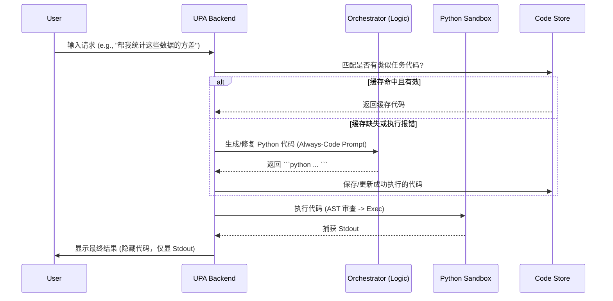

这份设计文档基于**“全量代码化（Unified Programmatic Architecture）”**的激进理念进行了重构。在这种架构下，意图识别（Router）被取消，系统通过单一的代码执行引擎处理从“闲聊”到“复杂逻辑”的所有任务。

---

# 统一程序化智能体 (UPA) 系统设计文档
**架构范式**: Always-Code Execution (ACE)
**版本**: v2.0 (全量代码化版本)

---

## 1. 系统愿景 (System Vision)
本系统将 LLM 视为一个**即时代码引擎 (JIT Code Engine)**。用户的所有输入（无论指令、数据处理还是闲聊）都被视为一个需要通过 Python 脚本解决的任务。
- **统一性**：消除对话与工具调用的边界，系统输出永远是可执行的 Python 代码。
- **确定性**：最终用户看到的回答是代码执行的 `stdout`（标准输出），确保逻辑运算的 100% 准确。
- **进化性**：通过代码缓存和自愈机制，系统能自动沉淀处理特例的高效脚本。

---

## 2. 核心工作流 (The ACE Workflow)

系统流程高度简化为单一闭环：

1.  **输入接收**：接收用户原始文本及上下文。
2.  **代码生成 (Orchestration)**：LLM 强制输出包裹在 \`\`\`python ... \`\`\` 块中的代码。
3.  **代码审查 (Guardrails)**：通过静态分析（AST）过滤高危库调用（如 `os.system`）。
4.  **沙箱执行 (Execution)**：在隔离环境中运行代码。
5.  **结果输出**：捕获 `stdout` 作为最终回复。
    - 若执行报错：将 Traceback 喂回给 LLM 自动修复。
    - 若执行成功：将代码存入缓存以便复用。

---

## 3. 核心模块设计

### 3.1 统一编排器 (Unified Orchestrator)
不再区分意图。通过高度约束的 **System Prompt** 驱动：
- **强制指令**：你是一个 Python 逻辑单元。你的回答必须**仅**包含一个 Python 代码块。
- **输出语义化**：
    - *闲聊场景*：LLM 生成 `print("你好！有什么我能帮你的？")`。
    - *逻辑场景*：LLM 生成复杂算法逻辑并 `print` 结果。
    - *语义场景*：调用预置的语义函数 `ask_sub_agent()` 处理模糊信息。

### 3.2 安全沙箱 (Sandbox Runtime)
- **技术栈**：Docker 容器或 WASM (WebAssembly) 隔离。
- **预置库**：`pandas`, `numpy`, `requests`, `datetime`, `re` 等常用库。
- **注入接口 (Standard Library Plus)**：
    - `ask_semantic(prompt)`: 当代码逻辑难以处理语义（如识别图片、分析情感）时调用。
    - `memo_save(key, val)`: 手动存储关键中间变量。

### 3.3 语义函数 (Semantic Function)
当遇到”无法用公式/规则解决”的问题时，代码会通过 SDK 回调另一个轻量级 LLM：
```python
# 示例：LLM 生成的代码片段
comments = [“太棒了”, “物流太慢”]
for c in comments:
    is_neg = ask_semantic(f”判断是否为负面评价: {c}”)
    if “是” in is_neg:
        print(f”检测到负面反馈: {c}”)
```

### 3.4 缓存与进化层 (Code-Cache & Evolution)
- **原理**：系统维护一个 `Code-Task` 数据库（Key 为任务特征的向量，Value 为代码）。
- **流程**：
    1.  检测当前任务是否与库中某个“成功特例”高度相似。
    2.  命中缓存后，直接取出代码并在沙箱运行。
    3.  若旧代码报错，触发“自愈流程”：LLM 根据报错信息修改旧代码，生成“新补丁”并更新数据库。

---

## 4. 关键架构组件图



---

## 5. 安全体系 (Guardrails)

由于系统是“全量代码化”，安全性是其生死线：

1.  **AST 静态白名单**：
    - 拦截一切 `import os, subprocess, sys` 等涉及内核操作的库。
    - 禁止使用 `__subclasses__`, `getattr` 等反射黑魔法绕过检查。
2.  **资源配额 (Quotas)**：
    - **CPU/GPU**: 限制单次代码运行周期。
    - **Time**: 强制超时机制（10s 内强制 KILL）。
    - **Network**: 仅允许访问预定义的 API 白名单。

---

## 6. 开发实施路线 (Implementation)

### ✅ Phase 1: MVP 实现 (已完成)
- [x] 开发 `Base Orchestrator`，强制 LLM 输出 Python
- [x] 实现本地沙箱，通过 `io.StringIO` 捕获 `print` 输出
- [x] 实现 AST 安全防护，拦截危险库调用
- [x] 测试标准：问”你好”和问”1+1”都能通过 `print` 输出正确结果

### ✅ Phase 2: 语义集成 (已完成)
- [x] 注入 `ask_sub_agent` SDK
- [x] 实现多级 LLM 调用：主模型写代码（复杂/昂贵），子模型在代码循环中处理语义（简单/便宜）
- [x] 实现多 Provider 支持（DashScope、Cloudflare）

### ✅ Phase 3: 自愈机制 (已完成)
- [x] 实现 `try-except` 捕获沙箱错误
- [x] 自动反馈错误信息给 LLM 修复
- [x] 子代理自愈（递归错误恢复）
- [x] `@safe_sub_agent` 装饰器简化语法

### ✅ Phase 4: CLI 增强 (已完成)
- [x] `--model` 标志覆盖 Provider 的默认模型
- [x] `--config` 标志设置默认 Provider 和模型
- [x] `.env.example` 模板配置

### ✅ Phase 5: Planner 架构 (已完成)
- [x] 动态提示词构建系统 (`planner.py`)
- [x] 查询分析器：识别任务意图和复杂度
- [x] 意图分类：`simple_chat`, `computation`, `semantic`, `hybrid`, `multi_step`
- [x] 动态工具选择：`ask_sub_agent`, `web_search`
- [x] 任务分解：复杂问题分步骤执行
- [x] 基准测试框架集成：Planner 追踪和统计

### ✅ Phase 6: 复杂度感知 Coder 选择 (已完成)
- [x] 基于 Planner 复杂度评估的动态 Coder 模型选择
- [x] 实现 `ComplexityModelMapping` 数据结构
- [x] 实现 `select_coder_model()` 核心选择逻辑
- [x] 重构 `main()` 执行流程：模型选择移至 Planner 之后
- [x] 支持 `--no-complexity-selection` CLI 标志禁用
- [x] 跨 Provider 支持（如目标 Provider 无 API Key 则回退）
- [x] 环境变量自定义映射：`UPA_MODEL_MAP_{INTENT}_{COMPLEXITY}`
- [x] 配置别名：`UPA_CODER_PROVIDER`/`UPA_CODER_MODEL`

**设计决策**：
- 使用 kimi-k2.5 处理 medium/complex 任务（可配置切换）
- 简单任务使用 grok-code-fast-1 快速响应

**映射配置**：
```python
# 默认映射（可通过环境变量覆盖）
DEFAULT_COMPLEXITY_MODEL_MAP = {
    (“computation”, “trivial”):   ComplexityModelMapping(“grok/grok-code-fast-1”),
    (“computation”, “simple”):    ComplexityModelMapping(“grok/grok-code-fast-1”),
    (“computation”, “medium”):    ComplexityModelMapping(“kimi-k2.5”, provider=”dashscope”, enable_self_check=True),
    (“computation”, “complex”):   ComplexityModelMapping(“kimi-k2.5”, provider=”dashscope”, enable_self_check=True),
    (“*”, “complex”):             ComplexityModelMapping(“kimi-k2.5”, provider=”dashscope”, enable_self_check=True),
}

# 环境变量自定义映射
# 格式：UPA_MODEL_MAP_{INTENT}_{COMPLEXITY}=model[:provider][:self-check]
# 示例：UPA_MODEL_MAP_computation_medium=kimi-k2.5:dashscope:self-check
```

### ✅ Phase 7: 代码自检机制 (已完成)
- [x] 生成带断言验证的代码（已在 Phase 5 实现）
- [x] 类型检查和范围验证模板

**自检代码模板**：
```python
# 非推理型 (快)
print(result)

# 推理型 + 自检 (慢但稳)
try:
    result = compute()
    # 自检逻辑
    assert type(result) in [int, float, str], f”Unexpected type: {type(result)}”
    if isinstance(result, (int, float)):
        assert -1e10 < result < 1e10, f”Result out of range: {result}”
    print(result)
except AssertionError as e:
    raise RuntimeError(f”Self-check failed: {e}”)
```

### ✅ Phase 8: 结构化输出 (set_output API) (已完成)

**目标**：从 stdout 拦截转向结构化输出，支持被外部 Orchestrator 调用。

**问题分析**：
1. **类型丢失**：`{“users”: [...]}` → 字符串 → 需要 `json.loads()` 重新解析
2. **日志混杂**：print() 混合调试信息和最终结果，无法区分
3. **并发不安全**：`sys.stdout` 重定向在多线程环境下是灾难
4. **压抑 CoT**：强制”不能输出过程信息”，压抑了 LLM 的思维链

**实现计划**：

```python
# 新增 OutputCollector 类
class OutputCollector:
    “””收集沙箱执行的最终结果”””
    def __init__(self):
        self._result = None
        self._has_result = False
        self._call_count = 0

    def set_output(self, data):
        “””设置最终输出结果（保持类型）”””
        self._call_count += 1
        if self._call_count > 1:
            raise RuntimeError(“set_output() can only be called once”)
        self._result = data
        self._has_result = True

    def get_output(self):
        “””获取当前输出结果（供代码内部链式处理）”””
        return self._result

    def has_output(self):
        return self._has_result
```

**沙箱注入**：
```python
sandbox_globals = {
    “set_output”: collector.set_output,
    “get_output”: collector.get_output,
    # ... existing ...
}
```

**代码示例**：
```python
def solve():
    # 调试输出（到 stderr，不影响结果）
    print(“Processing...”, file=sys.stderr)

    # 计算复杂数据结构
    result = {
        “total”: 100,
        “items”: [{“id”: 1, “name”: “A”}]
    }

    # 返回结果（保持类型）
    set_output(result)

solve()
```

**Prompt 变化**：
```
- 使用 set_output(data) 返回最终结果（保持原始数据类型）
- 可以使用 print() 输出调试信息（显示在日志中）
- 必须调用 set_output() 一次，否则报错
```

**错误处理**：
- 未调用 `set_output()` → 报错（严格模式）
- 多次调用 `set_output()` → 报错

**任务分解**：
- [x] 实现 `OutputCollector` 类
- [x] 修改 `execute_code()` 注入 `set_output`/`get_output`
- [x] 更新 SYSTEM_PROMPT 引导 LLM 使用新 API
- [x] 更新测试用例
- [x] 更新 benchmark 测试

### ✅ Phase 9: 逻辑契约 (Logic Contract) (已完成)

**目标**：强制工具结果被正确使用，解决 Coder 调用工具后忽略结果的问题。

**问题分析**：
1. Planner 输出过于抽象：只给出高-level 步骤描述，没有变量绑定
2. Coder 做的是"续写"任务：LLM 倾向于用训练数据知识，而非解析工具返回
3. 缺少数据流约束：工具返回值如何传递到下一步没有明确定义

**解决方案**：
将 Planner-Coder 关系从"架构师-码农"升级为"逻辑设计器-编译器"。

**新增数据结构**：
```python
@dataclass
class LogicStep:
    id: str              # "S1", "S2", ...
    action: str          # "web_search" | "ask_semantic" | "set_output"
    args: dict           # 工具参数（支持变量插值 {var}）
    input_vars: list     # 依赖的变量
    output_var: str      # 输出变量名
    description: str     # 步骤描述
```

**示例：Planner 输出**：
```json
{
  "logic_steps": [
    {"id": "S1", "action": "web_search", "args": {"query": "支架式教学概念"}, "output_var": "search_data"},
    {"id": "S2", "action": "ask_semantic", "args": {"query": "根据 {search_data} 回答问题"}, "input_vars": ["search_data"], "output_var": "answer"},
    {"id": "S3", "action": "set_output", "args": {"value": "{answer}"}, "input_vars": ["answer"]}
  ]
}
```

**Coder 编译结果**：
```python
search_data = web_search(query='支架式教学概念')
answer = ask_semantic(query=f'根据 {search_data} 回答问题')
set_output(answer)
```

**任务分解**：
- [x] 新增 `LogicStep` 数据结构
- [x] 修改 `Plan` 添加 `logic_steps` 字段
- [x] 升级 Planner Prompt 输出 `logic_steps`
- [x] 新增 `build_logic_contract_prompt()` 函数
- [x] 更新 `parse_plan_from_json()` 解析 `logic_steps`

---

## 7. 总结：为什么要这么做？

这种 **UPA (Unified Programmatic Agent)** 架构的核心优势在于：
1.  **极度简化后端**：不需要复杂的 Prompt 分流逻辑，只有一条路走到底。
2.  **不仅是对话**：这是一个能**自动编写并扩充自己功能**的软件。通过自愈代码，系统在应对边缘案例（Edge Cases）时会越来越稳固。
3.  **可解释性**：所有 AI 的行为都记录在它生成的 Python 脚本中。如果 AI 错了，我们可以清晰地看到它的”逻辑公式”错在哪一行，而不是去猜它的”心路历程”。

## 8. 后续演进方向

### 鲁棒性公式

```
鲁棒性 = Planner 准确分类 × Coder 能力匹配 × 自检覆盖率

当前：80% × 90% × 80%  ≈ 58%
目标：85% × 90% × 80%  ≈ 61%
```

### 🔄 Phase 10: Prompt 优化专项 (计划中)

**目标**：分层 Prompt 设计，减少 MMLU 特化程度，提高通用性和可维护性。

**当前问题分析**：
1. **Prompt 总量过大**：~9,500 字符，60% 为示例
2. **MMLU 特化程度高**：多选题规则、选项映射示例硬编码在核心 Prompt 中
3. **示例与规则混杂**：难以独立更新和维护
4. **Planner 任务判断不够精准**：意图分类和工具选择存在误判

**优化方案**：

#### 10.1 Prompt 分层架构

```
┌─────────────────────────────────────────────────────────┐
│ Layer 1: Core Rules (核心规则层)                         │
│   - 预定义函数说明                                       │
│   - 输出格式要求 (set_output)                           │
│   - 安全约束                                            │
│   ~800 字符                                             │
├─────────────────────────────────────────────────────────┤
│ Layer 2: Task Rules (任务规则层) - 动态注入              │
│   - 多选题规则 (检测到选项时注入)                        │
│   - 工具使用规范 (按需注入)                              │
│   - 自检要求 (medium/complex 任务注入)                   │
│   ~500-1000 字符 (按需)                                 │
├─────────────────────────────────────────────────────────┤
│ Layer 3: Examples (示例层) - 外置配置                    │
│   - MMLU 示例 (基准测试配置文件)                         │
│   - 工具链示例 (JSON 外置)                              │
│   - 按任务类型动态加载                                   │
│   ~1000-3000 字符 (按需)                                │
└─────────────────────────────────────────────────────────┘
```

#### 10.2 动态规则注入机制

```python
# 检测多选题特征
def detect_multiple_choice(query: str) -> bool:
    “””检测问题是否为多选题格式”””
    patterns = [
        r'[A-D][\.、\)）]',  # A. B. C. D. 或 A) B) C) D)
        r'选项\s*[A-D]',      # 选项A、选项B
        r'[A-D]\s*[是为]',    # A是... B为...
    ]
    return any(re.search(p, query) for p in patterns)

# 动态注入多选题规则
MULTIPLE_CHOICE_RULES = “””
【多选题输出规则】
- 必须输出选项字母 (A/B/C/D)，而非计算结果本身
- 示例：计算 12 × 8 = 96，对应选项 B，set_output(“B”)
“””
```

#### 10.3 Planner 优化

**意图分类优化**：
- 当前问题：简单计算被误判为 semantic，语义任务被误判为 computation
- 解决方案：增强判断规则，添加更多特征识别

**工具选择优化**：
- 当前问题：不必要的 web_search 调用，ask_semantic 滥用
- 解决方案：细化工具使用场景判断

```python
# 意图判断增强规则
INTENT_RULES = {
    “computation”: {
        “positive”: [r'\d+\s*[\+\-\*/\^]', r'计算', r'求.*值', r'斐波那契', r'素数'],
        “negative”: [r'翻译', r'总结', r'情感', r'是谁', r'什么是'],
    },
    “semantic”: {
        “positive”: [r'翻译', r'总结', r'情感分析', r'润色', r'改写'],
        “negative”: [r'\d+\s*[\+\-\*/\^]', r'计算'],
    },
    “multi_step”: {
        “positive”: [r'首都是哪', r'是谁提出', r'什么是.*概念', r'最新'],
        “requires_tools”: [“web_search”],
    },
}
```

**任务分解**：

- [ ] **10.1 Prompt 分层重构**
  - [ ] 提取 Core Rules 层 (~800 字符)
  - [ ] 创建 Task Rules 动态注入机制
  - [ ] 外置示例到 JSON 配置文件

- [ ] **10.2 多选题规则动态化**
  - [ ] 实现 `detect_multiple_choice()` 函数
  - [ ] 创建 `MULTIPLE_CHOICE_RULES` 模块
  - [ ] 更新 `build_coder_prompt()` 支持动态注入

- [ ] **10.3 Planner 意图分类优化**
  - [ ] 增强 `is_trivial_query()` 规则
  - [ ] 实现 `detect_intent()` 特征匹配
  - [ ] 添加 Planner 测试用例验证

- [ ] **10.4 Planner 工具选择优化**
  - [ ] 细化 `web_search` 使用场景判断
  - [ ] 明确 `ask_semantic` vs 直接输出的边界
  - [ ] 添加工具选择测试用例

- [ ] **10.5 测试与验证**
  - [ ] 回归测试：确保 MMLU 100% 通过率不下降
  - [ ] 通用性测试：非多选题场景表现
  - [ ] Prompt 长度对比：目标减少 30%

**预期收益**：
- Prompt 长度减少 30% (9,500 → ~6,500 字符)
- 非多选题场景准确性提升
- 更易于维护和扩展
- Planner 判断准确率提升至 85%

---

### 📋 Phase 11: Code Memory & Caching (延后)

基于向量相似度的代码缓存，延后开发。

---

## 9. 项目状态总览

| Phase | 功能 | 状态 |
|-------|------|------|
| Phase 1 | MVP 实现 | ✅ 完成 |
| Phase 2 | 语义集成 (ask_semantic) | ✅ 完成 |
| Phase 3 | 自愈机制 | ✅ 完成 |
| Phase 4 | CLI 增强 | ✅ 完成 |
| Phase 5 | Planner 架构 | ✅ 完成 |
| Phase 6 | 复杂度感知 Coder 选择 | ✅ 完成 |
| Phase 7 | 代码自检机制 | ✅ 完成 |
| Phase 8 | 结构化输出 (set_output API) | ✅ 完成 |
| Phase 9 | Logic Contract | ✅ 完成 |
| **Phase 10** | **Prompt 优化专项** | 🔄 计划中 |
| Phase 11 | Code Memory & Caching | ⏸️ 延后 |